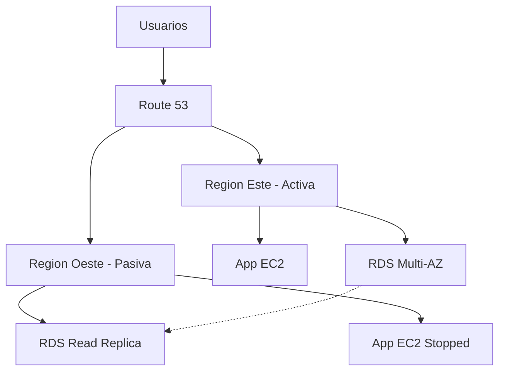

# **El Significado de la "D" (Recuperación ante Desastres) en CADD-SAML-DISCO: Lecciones de un Arquitecto Cloud**

**Como Arquitecto de Soluciones en la Nube con experiencia en incidentes reales**, la "D" (Disaster Recovery) representa uno de los aspectos más críticos y frecuentemente descuidados en el diseño de sistemas cloud.

## **🔍 El Costo Real de No Planificar para Desastres**

**Caso real compartido**:
- **Escenario**: Caída de data center en cloud provider
- **Impacto**: 
  - 2 días de downtime
  - $250 millones en pérdidas
- **Causa raíz**: Dependencia excesiva sin plan DR activo

## **⚡ Por Qué el DR es No Negociable**

1. **Dependencia crítica en proveedores cloud**: AWS/Azure/GCP no son inmunes a fallos
2. **Expectativas del negocio**: Cero tolerancia a interrupciones
3. **Requisitos regulatorios**: Compliance (ISO 27001, SOC 2) exige planes DR

## **🛠 Marco Profesional para DR Efectivo**

### **1️⃣ Definición de Objetivos Clave**
- **RPO (Recovery Point Objective)**: 
  - Máxima pérdida de datos aceptable (Ej: 15 minutos)
- **RTO (Recovery Time Objective)**:
  - Tiempo máximo de recuperación (Ej: 4 horas)

### **2️⃣ Estrategias Comprobadas**
| **Tipo**       | **Costo** | **RTO**     | **Ejemplo**                     |
|----------------|----------|-------------|----------------------------------|
| Backup/Restore | Bajo     | Horas/Días  | Snapshots S3 + AMIs              |
| Pilot Light    | Medio    | Minutos/Hrs | RDS Read Replica en otra región  |
| Warm Standby   | Alto     | Minutos     | Auto Scaling Group multi-región  |
| Active-Active  | Muy Alto | Casi cero   | Tráfico balanceado entre regiones|

### **3️⃣ Componentes Críticos del Plan**
1. **Inventario de assets críticos**
2. **Automatización de recuperación** (AWS CloudFormation DR Templates)
3. **Procedimientos documentados**
4. **Pruebas regulares** (Game Days)

## **❓ Preguntas que Todo Arquitecto Debe Responder**

### **1️⃣ ¿Tenemos un plan DR probado?**
- **Checklist**:
  - [ ] Mapeo de dependencias críticas
  - [ ] Scripts de recuperación automatizados
  - [ ] Contactos de emergencia actualizados

### **2️⃣ ¿Cómo mantenemos la continuidad operacional?**
- **Tácticas**:
  - **DNS Failover** (Route 53)
  - **Data Replication** (CRR en S3)
  - **State Management** (Session replication)

### **3️⃣ ¿Cumplimos con los RPO/RTO definidos?**
- **Ejercicio práctico**:
  - Simular caída de región primaria
  - Medir tiempo real de recuperación
  - Validar integridad de datos

## **💡 Implementación Real en AWS**

**Arquitectura Multi-Región Activa-Pasiva**:

## **🚀 Ejercicio Práctico: Plan DR para FinTech**

**Requisitos**:
- RPO: 5 minutos
- RTO: 30 minutos
- Compliance: PCI DSS Nivel 1

**Tareas**:
1. Diseñar estrategia DR adecuada
2. Calcular costos de implementación
3. Crear runbook de activación

## **🎯 Conclusión**

Lecciones clave del caso compartido:
1. **El DR no es opcional** en arquitecturas cloud modernas
2. **La simplicidad mata**: Diseños demasiado dependientes son riesgosos
3. **Las pruebas regulares** son la única forma de validar efectividad

**Recuerda**: "Un dólar invertido en prevención vale diez en recuperación". Incluye siempre el costo del DR en tus propuestas de valor.

**Próximo paso**: Exploraremos la "I" (Integración) para completar tu dominio de CADD-SAML-DISCO como arquitecto cloud de nivel experto.
