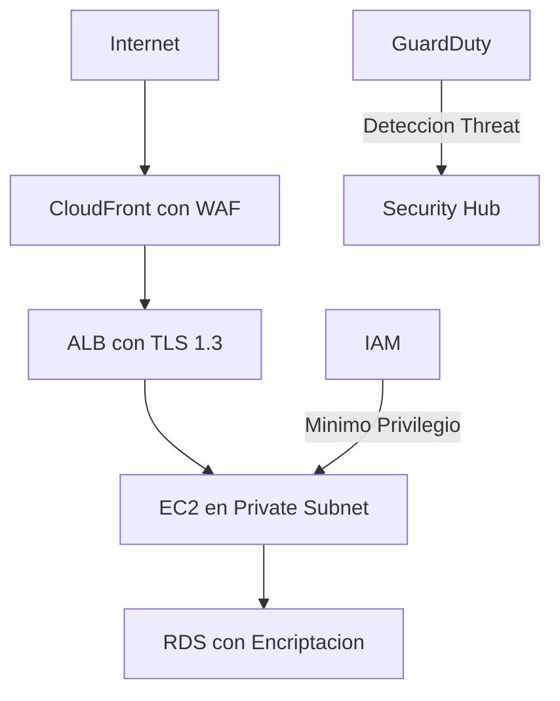

# **El Significado de la "S" (Seguridad) en CADD-SAML-DISCO: Protección Integral en la Nube**

**Como Arquitecto de Soluciones en la Nube especializado en seguridad**, la "S" (Security) representa el pilar más crítico en cualquier arquitectura cloud moderna.

## **🔍 La Doble Dimensión de la Seguridad Cloud**

### **1️⃣ Seguridad DE la nube** (Cloud Provider Responsibility)
- Protección física de data centers
- Hardware y virtualización
- Cumplimiento global (ISO 27001, SOC 2)

### **2️⃣ Seguridad EN la nube** (Customer Responsibility)
- Configuraciones de acceso
- Protección de datos
- Hardening de aplicaciones

## **🛠 Marco de Seguridad Multinivel**

### **Capa de Red**
- **Tácticas**:
  - Segmentación con VPC/Security Groups
  - WAF (AWS WAF, Cloud Armor)
  - DDoS Protection (Shield Advanced)

### **Capa de Identidad**
- **Mejores prácticas**:
  ```bash
  # Ejemplo AWS IAM: Política de mínimo privilegio
  {
    "Version": "2012-10-17",
    "Statement": [
      {
        "Effect": "Allow",
        "Action": "s3:GetObject",
        "Resource": "arn:aws:s3:::bucket-seguro/*"
      }
    ]
  }
  ```

### **Capa de Datos**
- **Protecciones esenciales**:
  - Encriptación en reposo (KMS, HSM)
  - Encriptación en tránsito (TLS 1.3)
  - Tokenización/Masking para PII

## **⚔️ Defensa contra Amenazas Comunes**

| **Ataque**          | **Mitigación**                          | **Herramientas AWS/Azure**          |
|---------------------|----------------------------------------|-------------------------------------|
| Inyección SQL       | WAF + Parameterized Queries            | AWS Shield + RDS Proxy             |
| Credential Stuffing | MFA + Rate Limiting                    | Azure AD Conditional Access        |
| Zero-Day Exploits   | Patch Management + Immutable Deployments | AWS Systems Manager + Azure Update |

## **🔍 Preguntas Clave de Auditoría de Seguridad**

### **1️⃣ ¿Tenemos visibilidad completa?**
- **Checklist**:
  - [ ] Logs de seguridad centralizados (SIEM)
  - [ ] Monitoreo de configuración (AWS Config)
  - [ ] Scans regulares de vulnerabilidades

### **2️⃣ ¿Estamos aplicando mínimo privilegio?**
- **Técnicas**:
  - Revisión trimestral de permisos
  - Roles temporales (AWS IAM Roles Anywhere)
  - Justificación de permisos elevados

### **3️⃣ ¿Cómo respondemos a incidentes?**
- **Playbook típico**:
  1. Contención (Aislar recursos)
  2. Investigación (CloudTrail + VPC Flow Logs)
  3. Erradicación (Rotar credenciales)
  4. Recuperación (Restaurar desde snapshots limpios)

## **💡 Arquitectura de Seguridad de Referencia**



## **🚀 Ejercicio Práctico: Hardening AWS**

**Tareas**:
1. Implementar:
   - Encriptación EBS predeterminada
   - Bloqueo de S3 público
   - Config rules para compliance
2. Automatizar:
   - Respuesta a S3 buckets públicos
   - Rotación automática de claves
3. Documentar:
   - Procedimientos de emergencia
   - Contactos de seguridad

## **🎯 Conclusión**

Para seguridad cloud efectiva:
1. **Adopta modelo Zero Trust**
2. **Automatiza cumplimiento** (AWS Security Hub)
3. **Educa continuamente** equipos
4. **Prueba defensas** (Red Team exercises)

**Recuerda**: "La seguridad no es un producto, es un proceso continuo". Invierte en crear una cultura de seguridad, no solo en herramientas.

**Próximo paso**: Completaremos DISCO con "C" (Cost Optimization) y "O" (Operational Excellence) para dominar todos los pilares del Well-Architected Framework.
