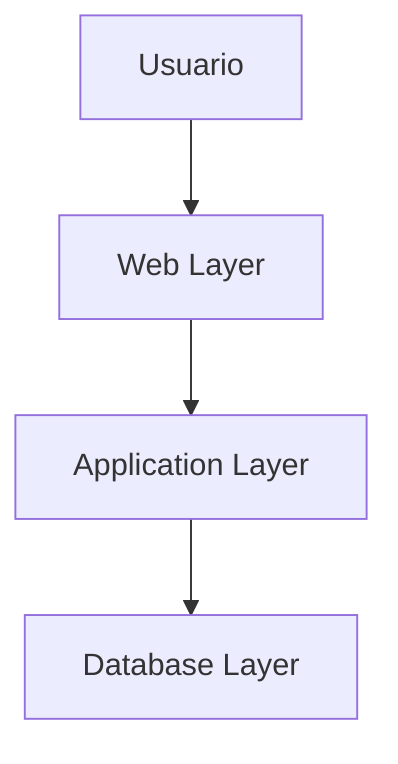
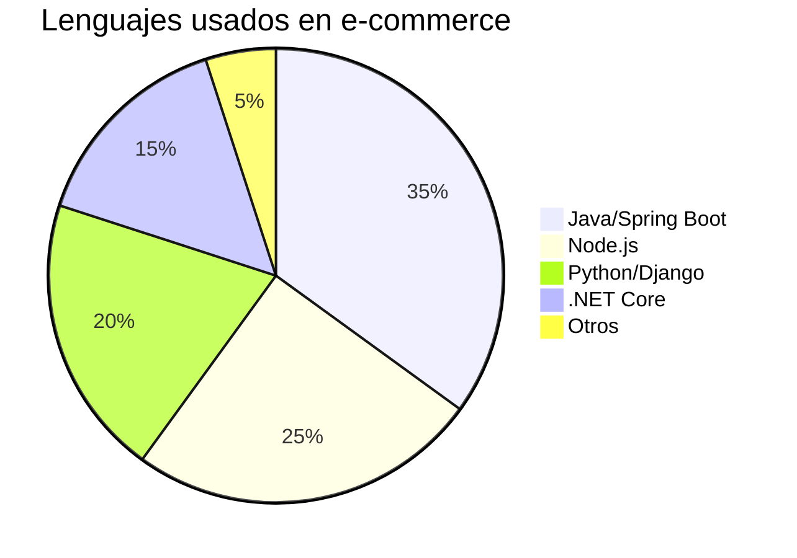

# **Arquitectura de Tres Capas: Diseño para E-Commerce en la Nube**

**Como Arquitecto de Soluciones especializado en aplicaciones web escalables**, explicaré el modelo de tres capas aplicado a un sitio de e-commerce como Amazon, detallando cada componente técnico y su interacción.

## **🌐 Diagrama de Arquitectura de Tres Capas**



## **🔍 Capa 1: Web Layer (Frontend)**
### **Función Principal**:
- **Interfaz de usuario** que recibe solicitudes HTTP/HTTPS
- **Sirve contenido estático** (HTML, CSS, JS, imágenes)

### **Componentes Técnicos**:
| **Elemento**       | **Tecnologías**                     | **Ejemplo AWS/Azure**          |
|--------------------|-------------------------------------|--------------------------------|
| Servidor Web       | Nginx, Apache, IIS                  | EC2 con AMI Linux/Windows      |
| CDN                | CloudFront, Akamai                  | AWS CloudFront + S3            |
| Balanceador de Carga| ALB, NLB                           | AWS Application Load Balancer  |

**Ejemplo Práctico**:
```bash
# Comando para verificar Nginx en EC2
ssh -i "key.pem" ec2-user@IP "sudo systemctl status nginx"
```

## **🖥 Capa 2: Application Layer (Backend)**
### **Lógica de Negocio**:
- **Microservicios clave**:
  1. User Management (AuthN/AuthZ)
  2. Product Catalog
  3. Shopping Cart
  4. Payment Processing
  5. Order Fulfillment

### **Stack Tecnológico**:


**Patrón de Implementación**:
- **Contenedores**: Docker + Kubernetes (EKS/AKS)
- **Serverless**: AWS Lambda + API Gateway
- **Mensajería**: SQS/SNS para desacople

## **🗃 Capa 3: Database Layer**
### **Modelos de Datos Clave**:
1. **Users** (DynamoDB/PostgreSQL):
   ```json
   {
     "user_id": "UUID",
     "email": "user@domain.com",
     "payment_methods": ["visa-****1234"]
   }
   ```
2. **Products** (Elasticsearch + RDS):
   - Búsqueda textual vs. Datos transaccionales
3. **Orders** (Aurora PostgreSQL):
   - Transacciones ACID críticas

### **Estrategias de Almacenamiento**:
- **Caching**: Redis/Memcached para carritos
- **Replicación**: Multi-AZ para alta disponibilidad
- **Backups**: Automatizados con AWS Backup

## **🔄 Flujo Completo: Ejemplo "Add to Cart"**

1. **Frontend** (Web Layer):
   - React.js envía POST `/api/cart` via Axios
   - CloudFront cachea assets estáticos

2. **Backend** (Application Layer):
   - API Gateway → Lambda (Node.js)
   - Valida JWT → Actualiza Redis Cluster
   - Publica evento a SNS (notificaciones)

3. **Database**:
   - DynamoDB actualiza `user_cart` table
   - Streams → Lambda (analítica en tiempo real)

## **⚡ Optimizaciones Cloud-Native**

### **Escalabilidad**:
- **Auto Scaling Groups** para Web/App tiers
- **Aurora Serverless** para base de datos

### **Seguridad**:
- **WAF** contra SQLi/XSS
- **KMS** para encriptación de PII

### **Costo**:
- **Spot Instances** para batch processes
- **S3 Intelligent-Tiering** para imágenes

## **🔧 Troubleshooting Común**

| **Síntoma**               | **Capa Afectada** | **Herramientas Diagnóstico**          |
|---------------------------|-------------------|---------------------------------------|
| Latencia alta (>2s)       | Web               | CloudWatch Logs + X-Ray               |
| 500 en checkout           | Application       | AWS Lambda Logs + API Gateway Metrics |
| Datos inconsistentes      | Database          | RDS Performance Insights              |

## **📈 Evolución a Arquitectura Avanzada**

1. **Migrar a Microservicios**:
   - Descomponer monolitos usando Domain-Driven Design
2. **Implementar Event-Driven**:
   - EventBridge para notificaciones de ordenes
3. **Adoptar IaC**:
   - Terraform para gestionar los tres tiers

**Ejemplo Terraform**:
```hcl
module "web_tier" {
  source = "./modules/web"
  ami_id = "ami-123456"
  instance_type = "t3.medium"
}
```

## **🎯 Conclusión**

Esta arquitectura proporciona:
- **Separación de preocupaciones** clara
- **Escalabilidad independiente** por capa
- **Resiliencia** mediante redundancia
- **Seguridad** por capas (VPC, NACLs, IAM)

**Recuerda**: "El 73% de las caídas en e-commerce se deben a diseños no escalables" (Gartner 2023). Usa este modelo como base para construir sistemas enterprise-grade.
