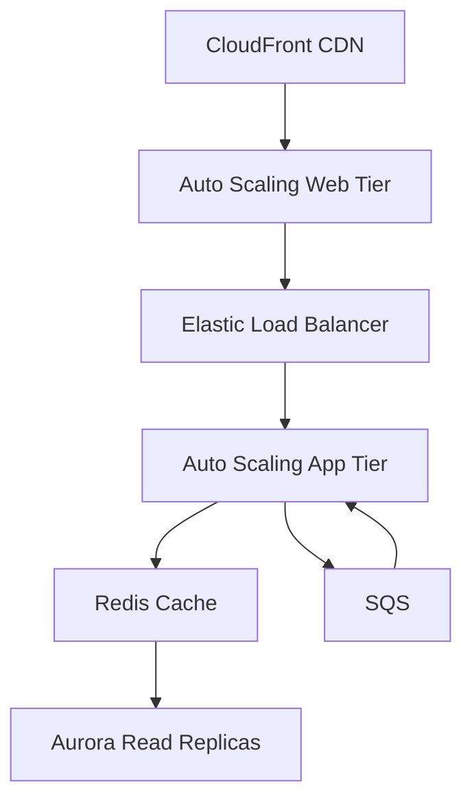

# **El Significado de la "S" (Escalabilidad) en CADD-SAML-DISCO: Diseñando para el Crecimiento**

**Como Arquitecto de Soluciones en la Nube certificado**, la "S" (Scalability/Escalabilidad) representa uno de los pilares fundamentales del Well-Architected Framework que todo profesional debe dominar.

## **🔍 Por Qué la Escalabilidad es Crítica en e-Commerce**

En el escenario propuesto:
- **Tráfico impredecible**: Eventos como Black Friday o campañas virales
- **Crecimiento estacional**: Variaciones mensuales/anuales
- **Disponibilidad constante**: Requerimiento 24/7 sin degradación

## **🛠 Estrategias de Escalabilidad Comprobadas**

### **1️⃣ Escalado Vertical (Scale-Up)**
- **Qué es**: Aumentar capacidad de instancias existentes
- **Cuándo usarlo**: Bases de datos relacionales, sistemas legacy
- **Limitaciones**: Máximos de hardware, requiere reinicio

### **2️⃣ Escalado Horizontal (Scale-Out)**
- **Qué es**: Añadir más instancias/nodos
- **Patrones clave**:
  - **Auto Scaling Groups** (AWS)
  - **Kubernetes HPA** (K8s)
  - **Serverless** (Lambda, Cloud Functions)

### **3️⃣ Escalado Elástico Automatizado**
Técnicas avanzadas:
- **Escalado predictivo**: Machine Learning para anticipar demanda (AWS Forecast)
- **Escalado programado**: Para patrones conocidos (horarios laborales)
- **Escalado basado en métricas**: CPU, RAM, colas (CloudWatch/Alerts)

## **❓ Preguntas Clave de Autoevaluación**

### **1️⃣ ¿Puedo escalar bajo demanda?**
- **Ejercicio práctico**: Configurar:
  - Grupo Auto Scaling para frontend web
  - Read Replicas para base de datos
  - Throttling para APIs

### **2️⃣ ¿Puedo reducir costos al bajar demanda?**
- **Tácticas**:
  - Instancias Spot para cargas flexibles
  - Scale-in policies agresivas
  - Serverless donde aplique

### **3️⃣ ¿Minimizo downtime en operaciones?**
- **Técnicas**:
  - Blue/Green deployments
  - Database failover automatizado
  - Circuit breakers para microservicios

## **💡 Patrones de Escalabilidad Comprobados**

1. **Caching estratificado**:
   - CDN (CloudFront, Fastly)
   - In-memory (Redis, Memcached)
   - Local (Browser caching)

2. **Desacople componentes**:
   - Colas (SQS, Pub/Sub)
   - Event-driven architectures
   - API Gateways + Lambda

3. **Database scaling**:
   - Read replicas
   - Sharding
   - Serverless (Aurora Serverless, Firestore)

## **🚀 Caso Práctico: e-Commerce Global**

**Requisitos**:
- Soportar 10x aumento tráfico en horas
- Mantener <2s response time
- Sin intervención manual

**Solución técnica**:

## **🎯 Conclusión**

Un arquitecto cloud competente debe:
1. **Prever necesidades** de escalabilidad desde el diseño
2. **Implementar automatización** para respuesta ágil
3. **Optimizar costos** en ciclos de baja demanda
4. **Documentar estrategias** para el equipo operativo

**Recuerda**: "La escalabilidad no es un feature, es un requisito no negociable en la nube". Domina estos conceptos para construir sistemas preparados para el crecimiento.

**Próximo paso**: Exploraremos la "A" (Disponibilidad) en SAML, complementando la escalabilidad con resiliencia operativa.
