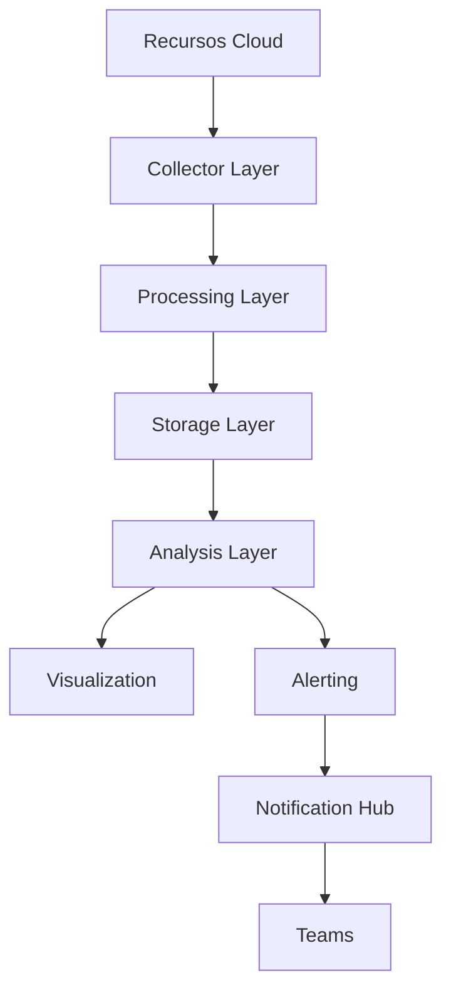

# **El Significado de la "M" (Monitoreo) en CADD-SAML-DISCO: Visibilidad Operacional en la Nube**

**Como Arquitecto de Soluciones en la Nube**, la "M" (Monitoring/Monitoreo) completa el acrónimo SAML y representa el sistema nervioso central de cualquier arquitectura cloud bien diseñada.

## **🔍 Importancia Estratégica del Monitoreo**

El monitoreo efectivo permite:
1. **Detección temprana** de anomalías
2. **Diagnóstico rápido** de incidentes
3. **Cumplimiento de SLA/SLO**
4. **Optimización continua** de recursos

## **🛠 Marco LAN para Monitoreo Integral**

### **L - Logs (Registros)**
- **Qué incluir**:
  - Logs de aplicaciones
  - Logs de infraestructura
  - Trazas distribuidas
- **Herramientas clave**:
  - AWS CloudWatch Logs
  - Azure Monitor Logs
  - ELK Stack

### **A - Alarms (Alertas)**
- **Configuraciones críticas**:
  - Umbrales basados en SLOs
  - Alertas multi-nivel (Warning/Critical)
  - Agregación inteligente
- **Ejemplos prácticos**:
  ```bash
  # Alerta de CPU en AWS CLI
  aws cloudwatch put-metric-alarm \
    --alarm-name "High-CPU-Utilization" \
    --metric-name CPUUtilization \
    --threshold 80 \
    --comparison-operator GreaterThanThreshold
  ```

### **N - Notifications (Notificaciones)**
- **Flujo de alertas profesional**:
  1. Nivel 1: Equipo On-Call (SMS/PagerDuty)
  2. Nivel 2: Ingenieros Senior (Email/Slack)
  3. Nivel 3: Arquitectos (Jira Tickets)

## **❓ Preguntas Clave de Implementación**

### **1️⃣ ¿Tenemos visibilidad completa?**
- **Checklist**:
  - [ ] Logs centralizados
  - [ ] Métricas clave instrumentadas
  - [ ] Trazas de transacciones

### **2️⃣ ¿Las alertas son accionables?**
- **Anti-patrones**:
  - Alertas que no requieren acción
  - Ruido excesivo (fatiga de alertas)
  - Umbrales estáticos ignorando patrones temporales

### **3️⃣ ¿El flujo de notificaciones es efectivo?**
- **Mejores prácticas**:
  - Escalamiento automático de incidentes
  - Runbooks adjuntos a cada tipo de alerta
  - Post-mortems automatizados

## **💡 Arquitectura de Monitoreo Avanzada**



**Capas clave**:
1. **Recolección**: Agentes/API-based
2. **Procesamiento**: Filtrado/enriquecimiento
3. **Almacenamiento**: TSDB para métricas
4. **Análisis**: Machine Learning para detección de anomalías

## **🚀 Ejercicio Práctico: Implementación Real**

**Escenario**: Monitoreo para plataforma de pagos:
1. Configurar:
   - Logs estructurados para transacciones
   - Alertas de latencia (>200ms)
   - Notificaciones escalonadas
2. Automatizar:
   - Creación de tickets en incidentes críticos
   - Captura de snapshots de diagnóstico

## **🎯 Conclusión**

Un sistema de monitoreo maduro debe:
1. **Predecir** problemas antes que ocurran
2. **Diagnosticar** rápidamente fallas
3. **Automatizar** respuestas básicas
4. **Documentar** patrones recurrentes

**Recuerda**: "Lo que no monitoreas, no puedes mejorar; lo que no alertas, no puedes reparar". Invierte en capacidades de observabilidad como ventaja competitiva.

**Próximo paso**: Exploraremos la "L" (Limitaciones) en SAML - porque conocer los límites es tan importante como aprovechar las capacidades.
